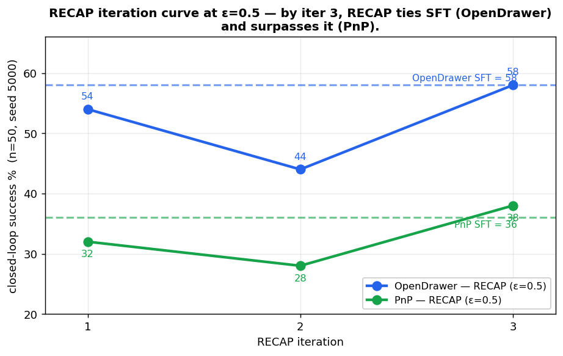

# RECAP (π*0.6) Reimplementation — Per-task Specialists on RoboCasa

Reimplementation of **RECAP** (RL with Experience and Corrections via Advantage-conditioned
Policies) from *π\*0.6: a VLA That Learns From Experience* (Physical Intelligence,
arXiv:2511.14759), built on **LeRobot π0.5** and the **RoboCasa** kitchen-manipulation
simulator, following the paper's Algorithm 1: **multi-task pretrain → per-task specialist
→ K=3 experience iteration**, with a **VLM value function** (scene-aware critic, as in the
paper's `V_pre` fine-tuned from the VLA backbone).

> **Our research question (the extension):** *can RECAP clear a strong behavior-cloning
> baseline at small scale, and what controls it?* We build a scene-aware **VLM value function**
> (frozen PaliGemma prefix features) in place of a cheap proprioception-only critic, and sweep
> the advantage threshold ε. Answer: with the scene-aware critic and a tuned **ε = 0.5**, RECAP
> reaches **equal-or-better than SFT** — a **tie on OpenDrawer (58 = 58)** and a **win on the
> harder PnP (38 vs 36)**. The threshold ε is the make-or-break knob: the common default
> ε = 0.3 is the *worst* point (an inverted-U), which is why a naive run looks weak.

📓 **The report IS the notebook: [`tutorial.ipynb`](tutorial.ipynb)** — paper walkthrough +
method + results + our research question, runnable end-to-end. This README is the repo guide;
the notebook is the writeup.

```bash
# read/run the report notebook (Path 1, no GPU): light conda env
conda env create -f environment.yml && conda activate recap-robocasa-nb
python -m ipykernel install --user --name recap-robocasa-nb
jupyter lab tutorial.ipynb
# closed-loop eval (Path 2, GPU): full LeRobot+RoboCasa stack — see §1 below
```



**Headline — RECAP (VLM-VF, ε = 0.5) vs SFT**, per-task specialists, success rate % (n=50, held-out seed 5000):

| Task | SFT | RECAP i1 | RECAP i2 | RECAP i3 | best vs SFT |
|---|---:|---:|---:|---:|:--:|
| OpenDrawer | 58 | 54 | 44 | **58** | = tie |
| PnP(CounterToCab) | 36 | 32 | 28 | **38** | +2 win |

**Two ingredients.** (1) *Critic* — the scene-aware VLM value function matches-or-beats the
proprio-only critic (OpenDrawer 50 vs 48; PnP tie at 32), so we adopt it throughout. (2)
*Threshold* — an ε ∈ {0.1, 0.3, 0.5} sweep shows an **inverted-U** with ε = 0.5 best (OpenDrawer
52/46/**58**, PnP 38/32/**38** at ε = 0.1/0.3/0.5). Full analysis in `tutorial.ipynb` §8–§11.

---

## 1. Environment setup

Tested on Linux + NVIDIA B200 (CUDA 12.8). Python 3.12 via `uv` (or conda/venv).

```bash
uv venv .venv --python 3.12 && source .venv/bin/activate

# LeRobot (pi0.5 + datasets), editable
git clone https://github.com/huggingface/lerobot refs/lerobot && cd refs/lerobot
git checkout v0.5.2   # version used in this work
pip install -e ".[pi,dataset]" && cd ../..

# robosuite / robocasa (pinned SHAs from LeRobot's docker/Dockerfile.benchmark.robocasa)
mkdir -p third_party && cd third_party
git clone https://github.com/ARISE-Initiative/robosuite && (cd robosuite && git checkout aaa8b9b)
git clone https://github.com/robocasa/robocasa && (cd robocasa && git checkout 56e355c)
pip install -e robosuite && pip install -e robocasa --no-deps && cd ..
pip install "mujoco==3.3.1" "numpy==2.2.5" numba opencv-python-headless av

# RoboCasa kitchen assets (lightweight pack)
python -m robocasa.scripts.download_kitchen_assets   # tex / fixtures_lw / objs_lw
```

**Known traps (and the fixes baked into this repo):**
- `egl_probe` builds from sdist → needs `pip install cmake` + `CMAKE_POLICY_VERSION_MINIMUM=3.5`.
- Headless MuJoCo (`MUJOCO_GL=egl`) needs the GLVND frontend (`libEGL.so.1`). If your node only
  ships the NVIDIA vendor lib, extract Ubuntu jammy `libglvnd0`/`libegl1` debs into `glvnd/root/`
  and prepend `glvnd/root/usr/lib/x86_64-linux-gnu` to `LD_LIBRARY_PATH` (the sbatch files do this).
- Video decode uses **`video_backend="pyav"`** everywhere (torchcodec needs a matching system
  ffmpeg ABI; pyav ships its own).
- Task datasets whose live env needs object assets outside the lightweight pack
  (e.g. TurnOnMicrowave, CoffeeSetupMug) can train but not roll out — pick tasks accordingly.

## 2. Data & base model

```bash
export HF_HOME=$PWD/.hf HF_LEROBOT_HOME=$PWD/.lerobot
# demos (LeRobotDataset v3, ~0.2-0.6 GB each)
for t in OpenDrawer PickPlaceCounterToCabinet; do
  huggingface-cli download pepijn223/robocasa_$t --repo-type dataset \
      --local-dir .lerobot/pepijn223/robocasa_$t
done
huggingface-cli download lerobot/pi05_base   # generic π0.5 weights
```

## 3. Pipeline (paper Algorithm 1)

```bash
# Stage 1 — pretrain π_pre: multi-task BC over all 4 task demos (4-GPU DDP)
sbatch slurm/finetune_robocasa_multitask.sbatch sft        # -> outputs/.../multi_task/sft

# Stage 2 — per-task specialists, fine-tuned FROM π_pre
TASK=OpenDrawer BASE=$PWD/outputs/robocasa/multi_task/sft EXPERT=full \
  sbatch slurm/finetune_robocasa.sbatch sft none outputs/robocasa/specialist/OpenDrawer/sft

# Stage 3 — RECAP iteration k = 1..3 (per task)
#  (a) autonomous rollouts, auto-labeled by the simulator (conditioned "Advantage: positive")
sbatch slurm/collect_rollouts_lerobot_robocasa.sbatch <policy_dir> OpenDrawer positive
#  (b) VLM value function (scene-aware critic = paper's V_pre): extract frozen PaliGemma
#      prefix features once (4-GPU), then train a distributional VF on those features
sbatch slurm/extract_vlmvf_robocasa.sbatch            # -> <task>/vlmvf/features.npy
sbatch slurm/vlmvf_train_indicators.sbatch            # VF + per-task ε_ℓ indicators (--features)
#      (proprio-VF ablation: same scripts WITHOUT --features = the 16-dim-state critic)
#  (c) advantage-conditioned RECAP specialist, re-trained from π_pre (4-GPU, eff-batch 8)
ROLLOUTS=<comma_list> TASK=OpenDrawer BASE=<π_pre> EXPERT=full \
  sbatch slurm/finetune_robocasa_4gpu.sbatch recap <indicators.npz> <out_dir>
#  (d) closed-loop eval (n=50, held-out seed)
SEED=5000 sbatch slurm/eval_robocasa.sbatch <out_dir> positive OpenDrawer 50 10

# Figures + showcase videos
python build_notebook.py                              # regenerates the ε=0.5 curve + diagrams + notebook
sbatch slurm/record_showcase.sbatch <ckpt> OpenDrawer positive <out> 10   # labeled rollout clips
```

The full K=3 × 4-task sweep + ε-sweep were run with an idempotent, preemption-safe orchestrator
(`slurm/vlmvf_manage.sh` + `vlmvf_watcher.sbatch`): output-driven submission across own/extra/share
QOS, with resume (extract shards, RECAP checkpoints) and auto-resubmit on preemption.

### 3b. Running on a plain GPU machine (no Slurm)

The `slurm/*.sbatch` files are just thin wrappers — each sets a few environment variables and
then calls a plain `python` / `torchrun` command. On a single GPU box (workstation, cloud VM,
Colab) you can run those commands directly. First export the same env the wrappers set:

```bash
export HF_HOME=$PWD/.hf HF_LEROBOT_HOME=$PWD/.lerobot HF_HUB_OFFLINE=1 TRANSFORMERS_OFFLINE=1
export PYTHONPATH=recap TOKENIZERS_PARALLELISM=false TORCHDYNAMO_DISABLE=1
# for closed-loop eval / video recording (headless RoboCasa needs an EGL GL frontend):
export MUJOCO_GL=egl CMAKE_POLICY_VERSION_MINIMUM=3.5
# only if your node lacks libEGL.so.1 (see §1): prepend the vendored GLVND libs
export LD_LIBRARY_PATH=$PWD/glvnd/root/usr/lib/x86_64-linux-gnu:${LD_LIBRARY_PATH:-}
```

Then run each stage directly (use `torchrun --nproc_per_node=<#GPUs>` for the multi-GPU steps,
or just `python` on a single GPU):

```bash
# pretrain π_pre (multi-task BC); single GPU -> python, multi -> torchrun
python recap/scripts/train_pi05_recap_robocasa.py --tasks OpenDrawer,PickPlaceCounterToCabinet \
  --root .lerobot --base_ckpt lerobot/pi05_base --mode sft --steps 8000 --out outputs/robocasa/multi_task/sft

# per-task SFT specialist (from π_pre)
python recap/scripts/train_pi05_recap_robocasa.py --root .lerobot/pepijn223/robocasa_OpenDrawer \
  --repo_id pepijn223/robocasa_OpenDrawer --base_ckpt outputs/robocasa/multi_task/sft \
  --mode sft --steps 6000 --out outputs/robocasa/specialist_v2/OpenDrawer/sft

# VLM value function: extract features (multi-GPU recommended) -> train VF -> indicators
torchrun --nproc_per_node=4 recap/scripts/extract_vlm_features_robocasa.py --root .lerobot \
  --base_ckpt outputs/robocasa/multi_task/sft --demos pepijn223/robocasa_OpenDrawer --rollouts <rollout_repo_ids...> \
  --out outputs/robocasa/specialist_v2/OpenDrawer/vlmvf
python recap/scripts/train_vf_robocasa_multitask.py --demos pepijn223/robocasa_OpenDrawer --rollouts <...> \
  --features .../vlmvf/features.npy --out .../vlmvf
python recap/scripts/compute_indicators_robocasa_multitask.py --vf .../vlmvf/vf.pt \
  --features .../vlmvf/features.npy --rollouts <...> --positive_fraction 0.30 --demo_positive --tag_suffix corr_vlmvf --out .../vlmvf

# advantage-conditioned RECAP specialist
python recap/scripts/train_pi05_recap_robocasa.py --root .lerobot --tasks OpenDrawer --rollouts <...> \
  --base_ckpt outputs/robocasa/multi_task/sft --mode recap --indicators .../indicators_p30corr_vlmvf.npz \
  --steps 6000 --out outputs/robocasa/specialist_v2/OpenDrawer/recap_vlmvf

# closed-loop eval (or pull a published checkpoint instead of a local path)
SEED=5000 python recap/scripts/eval_cli_wrap.py --policy.path=dongjin630/recap-robocasa-OpenDrawer-vlmvf \
  --env.type=robocasa --env.task=OpenDrawer --eval.n_episodes=50 --eval.batch_size=1 \
  --eval.use_async_envs=false --policy.device=cuda --policy.n_action_steps=10 --seed=5000 --output_dir outputs/eval/demo
```

Full-finetune of the 3B model uses gradient checkpointing and fits on a single ~80 GB GPU
(B200/A100/H100); reduce `--batch_size` if you hit OOM on smaller cards. No Slurm, queue, or
multi-node setup is required — only GPUs and the env above.

## 4. Repo map
```
recap/recap/        core RECAP modules
  robocasa_data.py            rewards/returns (Eq.5) + episode tables
  robocasa_vf.py              distributional value function (Eq.1, two-hot CE)
  advantage_robocasa.py       N-step advantage + per-task ε_ℓ (App.F)
  robocasa_multitask_data.py  demo+rollout combination, positional alignment
  advantage_dataset.py        "Advantage: positive/negative" conditioning (Eq.3)
recap/scripts/      entry points:
  extract_vlm_features_robocasa.py  frozen PaliGemma prefix features -> scene-aware critic input
  train_vf_robocasa_multitask.py    distributional VF (--features = VLM-VF; omit = proprio-VF)
  compute_indicators_robocasa_multitask.py   N-step advantage + per-task ε_ℓ indicators
  train_pi05_recap_robocasa.py      advantage-conditioned π0.5 finetune (resume-capable)
  collect_rollouts_lerobot_robocasa.py / eval_cli_wrap.py / record_showcase.py
slurm/              cluster job templates + orchestrator (manage/watcher, own/extra/share)
docs/assets/        figures + rollout videos embedded by tutorial.ipynb
tutorial.ipynb      the report (paper walkthrough + method + results + research question)
```

## License / credits
Educational reimplementation. Built on [LeRobot](https://github.com/huggingface/lerobot)
(Apache-2.0), [RoboCasa](https://robocasa.ai), and datasets by `pepijn223`.
π\*0.6 / RECAP is by Physical Intelligence (arXiv:2511.14759).

## 5. Evaluating the published checkpoints (HF Hub)

Published on the HuggingFace Hub under **[`dongjin630`](https://huggingface.co/dongjin630)** so
anyone can reproduce the closed-loop numbers without training. `PI05Policy.from_pretrained`
resolves Hub ids directly, so eval works the same with a Hub id as with a local dir:

```bash
SEED=5000 sbatch slurm/eval_robocasa.sbatch dongjin630/recap-robocasa-OpenDrawer-sft    none     OpenDrawer 50 10
SEED=5000 sbatch slurm/eval_robocasa.sbatch dongjin630/recap-robocasa-OpenDrawer-vlmvf  positive OpenDrawer 50 10
```

Model cards (per task ℓ ∈ {OpenDrawer, PnPCounterToCab}):
- `dongjin630/recap-robocasa-<task>-sft` — SFT specialist (demo-only baseline)
- `dongjin630/recap-robocasa-<task>-vlmvf` — RECAP specialist trained with the VLM value
  function (best iteration; evaluate with `positive` conditioning)

Upload (maintainer): `bash scripts_release/upload_checkpoints.sh dongjin630 outputs/robocasa "sft vlmvf"`
